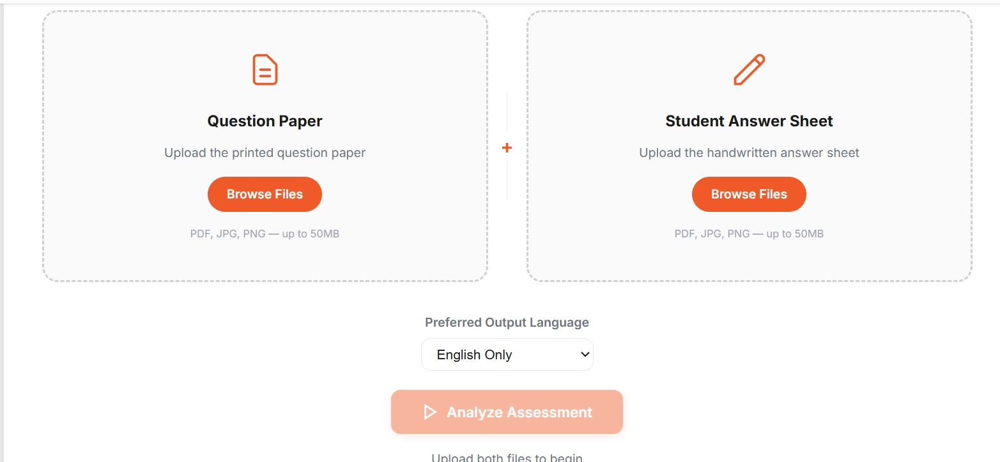
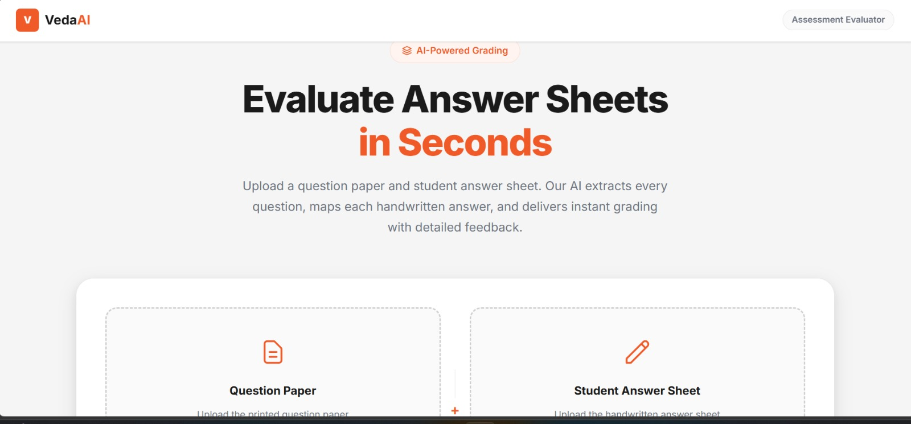
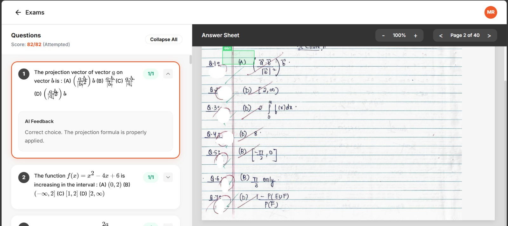
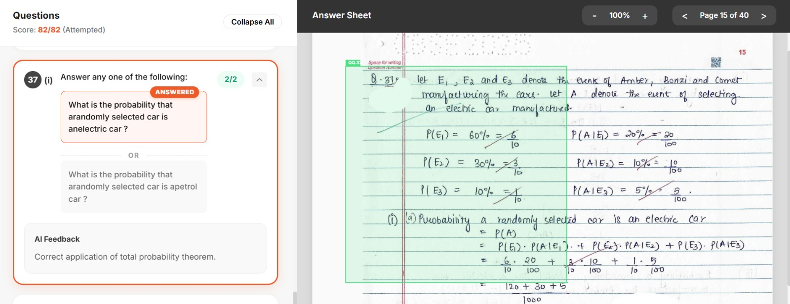
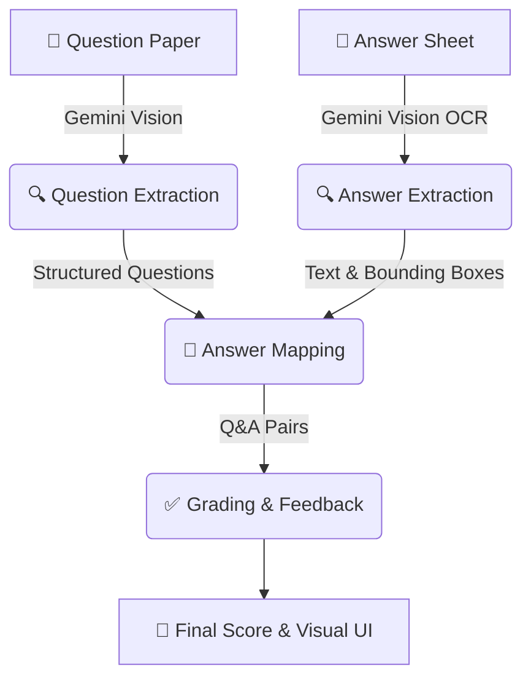

# VedaAI — AI Assessment Extraction & Answer Mapping

> Automatically extract questions from a question paper, map student handwritten answers, and deliver AI-powered grading with visual highlights.

## 🚀 Live Demo
*[Add Vercel URL after deployment]*

## 📸 Screenshots

### Upload Interface



### Grading & Feedback View



## ⚙️ Setup

### 1. Clone the repo
```bash
git clone <your-repo>
cd veda.ai
npm install
```

### 2. Add your Gemini API key
Create a `.env.local` file. The app supports automatic key rotation if you provide multiple keys to bypass rate limits!
```env
GEMINI_API_KEY=your_key_here
GEMINI_API_KEY_2=your_second_key_here
```
Get a free key at: https://aistudio.google.com/app/apikey

### 3. Run locally
```bash
npm run dev
```
Open http://localhost:3000

## 🏗️ Architecture

**Tech Stack:** Next.js 14 (App Router) · TypeScript · Vanilla CSS · **Google Gemini 3.5 Flash-Lite**

**AI Pipeline Workflow:**


**AI Pipeline:**
1. **Question Extraction** — Gemini Vision reads the question paper, extracts all questions in order, handles sub-parts (11a, 11b) and "OR" options as structured entries.
2. **Answer Extraction** — Gemini Vision processes each answer sheet page with OCR, extracts handwritten text and bounding boxes (normalised 0–1 coordinates).
3. **Answer Mapping** — Gemini matches each answer region to its corresponding question, handles out-of-order answers, flags unanswered questions and unmatched answers.
4. **Grading & Feedback** — Gemini evaluates each Q&A pair, awards marks, and generates per-question feedback. Calculates total score, percentage, and grade.

**Highlighting & UI:** When a teacher clicks a question on the left panel, it turns active (orange highlight) and the corresponding answer region's bounding box is drawn directly onto an HTML5 Canvas overlay on the answer sheet image. The drawing logic is highly robust and automatically normalises any malformed AI coordinate outputs.

## 📁 Structure
```
app/
  page.tsx              # Upload page
  processing/page.tsx   # Progress page  
  review/page.tsx       # Main review (question list + viewer + feedback)
  api/analyze/route.ts  # API: orchestrates Gemini pipeline
lib/
  gemini.ts             # Gemini API client (extraction, mapping, grading, rotation)
  pdfRenderer.ts        # Client-side PDF-to-image conversion using PDF.js
  types.ts              # TypeScript interfaces
```

## 🎯 Features
- ✅ Drag-and-drop upload (PDF, JPG, PNG)
- ✅ Multi-page answer sheets
- ✅ Sub-parts as separate questions (11a, 11b)
- ✅ "OR" Option detection and mapping
- ✅ Out-of-order answer handling
- ✅ Unanswered & unmatched answer detection
- ✅ **Robust visual bounding box highlight** on answer sheet (handles AI hallucinations)
- ✅ Per-question AI feedback with LaTeX math rendering
- ✅ Overall grade and score summary
- ✅ **API Key Rotation & Configurable Rate Limits** (built-in limits at 500 requests/day per key)

## 🤖 AI Model
**Google Gemini 3.5 Flash-Lite**
- Unmatched multimodal vision capabilities for PDF/image understanding
- High accuracy OCR for handwritten text
- Strong instruction following for structured JSON output
- Extremely fast inference for grading loops

## ⚠️ Assumptions & Limitations
- Bounding boxes are approximate (LLM-generated, not pixel-perfect).
- Very poor handwriting may reduce OCR accuracy.
- Large PDFs (>50MB) may timeout — recommend splitting into pages.
- Ensure your Google Cloud Project has billing enabled to use advanced models without running into "403 Forbidden" errors.
